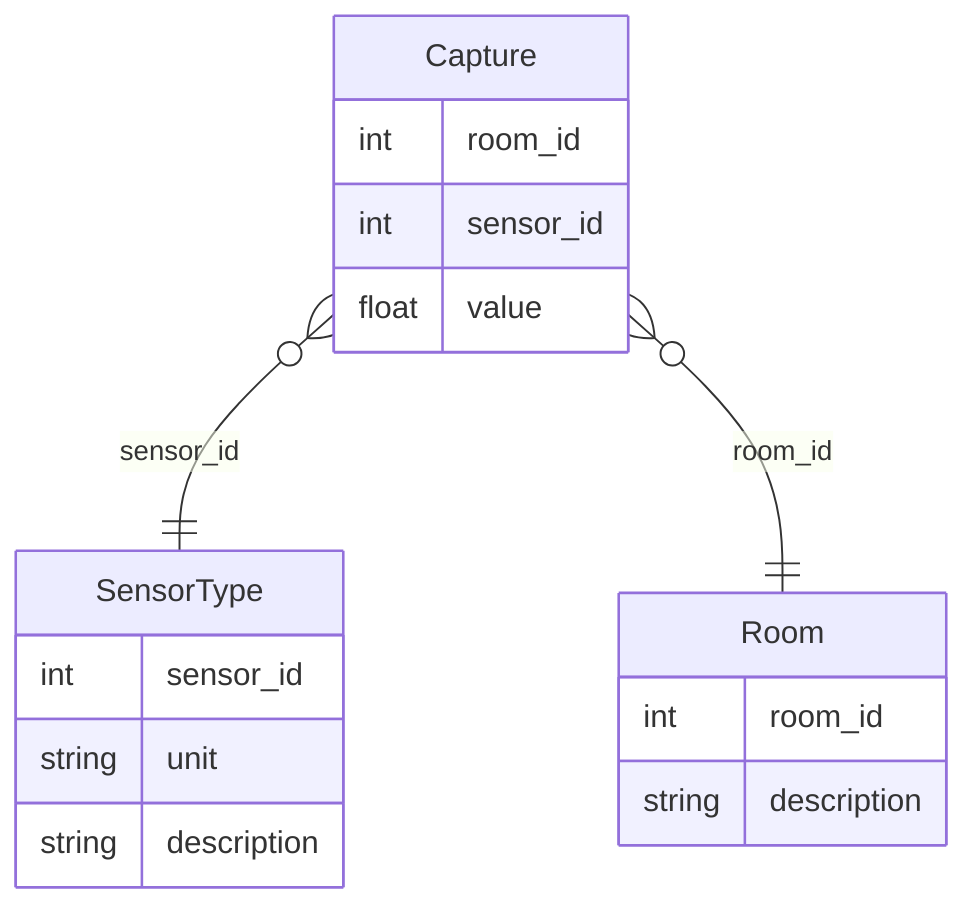

# Project
## Structure of this document
First we will [explain how to setup the environment](#installation-of-the-project) to execute this code.
Then we will explain [how we will model the data](#data-model).
Finally we will explain [the code structure and decision](#code-structure).
Finally we will [explain how we would setup the CI&CD (will not be done here)](#cicd-and-other-improvements).

## Task:
Create a backend service that handles and analyzes temperature data from multiple buildings and rooms.
### Requirements:

* Create a RESTful API with two endpoints:
  * POST endpoint to receive temperature data from building rooms
  * GET endpoint to retrieve the 15-minute average temperature for a specified building and room
    Store temperature records in a database.
* Provide a Dockerfile for containerization and explain how to deploy the service to Kubernetes.
* Outline a CI/CD pipeline for testing and deployment.

## Installation of the project
### Running the code
If you are using vscode, just launch it with devcontainers.
[documentation](https://code.visualstudio.com/docs/devcontainers/containers#_reopen-folder-in-container)

### Running the tests

## Architecture decisions
### Data model
#### Assumptions
* One sensor will measure the temperature of only one room. (No sensor going between two rooms, since it would mean that the rooms are directly connected, and we can see it as a single thermal capacity, so finally, a room).
* We keep the possibility to have more metrics in the future, such as humidity. (Which is why we have a SensorType table. That table also allows us to have different type of sensors, for which some might need preprocessing, or have different accuracies).

* For this prototype we will ignore data pollution (sensor issues, etc).
* We will also ignore the authorization&authentication system. But for a production environment we will need it. (I will however indicate in the code where it should be checked.)

* We might want to attach informations to a room, which is why we have a table Room. (For example, who is the customer, the type of walls, or anything relevant.)

#### Model
We will go for a [third normal](https://en.wikipedia.org/wiki/Third_normal_form) form as it is the best compromise between simplicity and safety (from anomalies)

### Code structure

### CI&CD and other improvements
