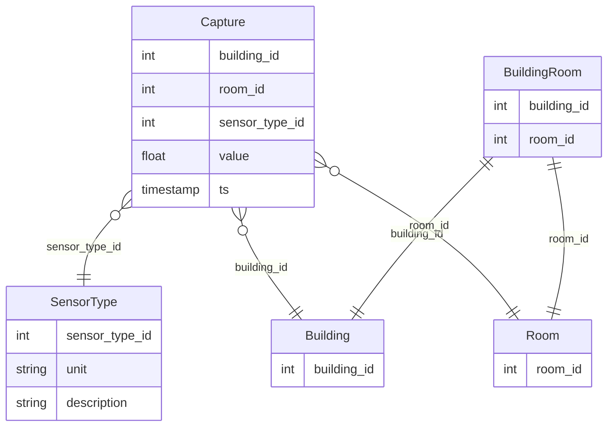

# Project
## Structure of this document
First we will [explain how to setup the environment](#installation-of-the-project) to execute this code.
Then we will explain [how we will model the data](#data-model).
Finally we will explain [the code structure and decision](#code-structure).
Finally we will [explain how we would setup the CI&CD (will not be done here)](#cicd-and-other-improvements).


## Task:
Create a backend service that handles and analyzes temperature data from multiple buildings and rooms.
### Requirements:

* Create a RESTful API with two endpoints:
  * POST endpoint to receive temperature data from building rooms
  * GET endpoint to retrieve the 15-minute average temperature for a specified building and room
    Store temperature records in a database.
* Provide a Dockerfile for containerization and explain how to deploy the service to Kubernetes.
* Outline a CI/CD pipeline for testing and deployment.


## Installation of the project
### Running the code
Install docker and run:

```bash
docker-compose up
```
You can then open your browser at : [http://localhost:8080/docs](http://localhost:8080/docs)

If we want to deploy it on kubernetes, we have several methods to do it.
We could be using helm + argo cd etc...

If we are using plain Kubernetes, we can just create a manifest that would contain:
- a deployment
- a service with the image we built, the port etc...
- an ingress (through nginx or aws alb for instance) for the two endpoints we created.


### Running the tests
If you are using vscode, just launch it with devcontainers.
[documentation](https://code.visualstudio.com/docs/devcontainers/containers#_reopen-folder-in-container)


## Architecture decisions
### Data model
#### Assumptions
* One sensor will measure the temperature of only one room. (No sensor going between two rooms, since it would mean that the rooms are directly connected, and we can see it as a single thermal capacity, so finally, a room).
* We keep the possibility to have more metrics in the future, such as humidity. (Which is why we have a SensorType table. That table also allows us to have different type of sensors, for which some might need preprocessing, or have different accuracies).

* For this prototype we will ignore data pollution (sensor issues, etc).
* We will also ignore the authorization&authentication system. But for a production environment we will need it. (I will however indicate in the code where it should be checked.)

* We might want to attach informations to a room, which is why we have a table Room. (For example, who is the customer, the type of walls, or anything relevant.)

* We push one metric at a time (no batch pushing.)

* Temperatures will be in kelvin if not said otherwise.

* We will suppose that the sensors actually have an internal clock and send their timestamp. That's just to simplify this example and not having to mock a clock for tests (and do dependency injection).

#### Model
We will go for a [third normal](https://en.wikipedia.org/wiki/Third_normal_form) form as it is the best compromise between simplicity and safety (from anomalies)


Note: We will not be using `BuildingRooms`. It is here just to show what we should have to connect the rooms to the buildings in the third normal form.
To keep it simple we will also not have a sensor_id, but just a sensor type id.


### Code structure
#### Frameworks
We will be using [fastapi](https://fastapi.tiangolo.com/) that is a simple framework that allows to generate a swagger and takes usage of the typehint, which is great for documentation.
However in a production environment, I would recommend using a compiled language (rust || golang) based on the requirements. For microservices I would also recommend GRPC (such as for the authorization system if we do not use something prebuilt such as aws verified permissions, for internal endpoints, or if we will have a high frequency or high volumetry, as the protobuf format can save costs in the infrastructure, while keeping it extremely readable.)

### Tests
We will be using testcontainers to setup the database so we do not hit the production database during tests. We will be passing the database connection string in the environment variables for this project. Though it could rather be handled by a secret manager (aws for instance) or through kubernetes secrets etc...

What are we testing in those unit tests:
* That we can update data
* That when we try to get the most recent 15min average, it is not polluted by other rooms or buildings.
* That we cannot push invalid data (here <0°K)


What we could also test in the future:
* Testing with multiple sensor types.
* Testing for sql injection etc...


### CI&CD and other improvements
In production we would be using PantsBuild (https://www.pantsbuild.org/) which would allow us to easilly build and deploy, and also launch tests based on the affected targets.
We would then be running it on our github pipeline through the github actions on commit & push.

In production instead of just copying the data into the docker image, we would be using proper packaging (through pantsbuild, or setup build for instance).

We could also add a layer of abstraction to the data fetching to separate concerns..

Finally we should connect our service to [prometheus](https://github.com/prometheus/prometheus) to have real time metrics.
